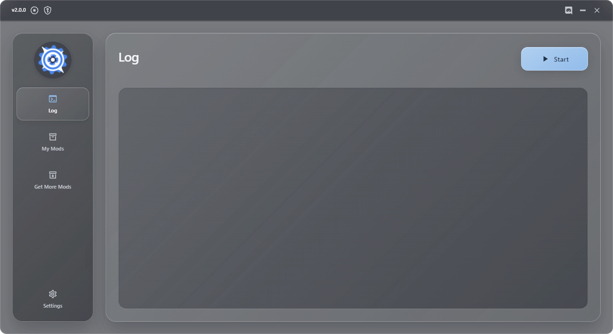
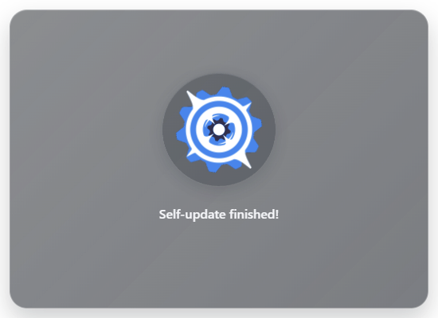
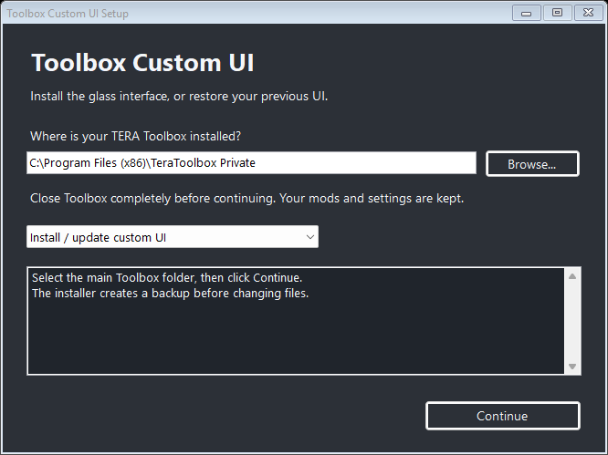
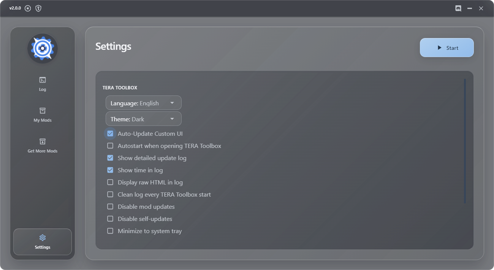

# Toolbox Custom UI

A smoked-glass theme for **TERA Toolbox on Windows**, with a translucent gray base, icy blue accents, and matching startup splash.



Version 1.1.1 includes an EXE installer with a folder picker and a native **Auto-Update Custom UI** checkbox in Toolbox Settings. The outer window, translucent surface, and title bar share rounded corners.



## Install into your Toolbox

1. **Close TERA Toolbox completely**, including its tray instance.
2. [Download ToolboxCustomUI-Setup.exe](https://github.com/pyureee/toolbox-custom-ui/raw/refs/heads/main/downloads/ToolboxCustomUI-Setup.exe).
3. Run the EXE. Click **Browse** or paste the path to your Toolbox **main folder**. For example: `C:\Program Files (x86)\TeraToolbox Private`. Select the folder containing `bin`, `mods`, and `node_modules`.
4. Choose **Install / update custom UI**, then click **Continue**. Windows asks for administrator access only if that folder needs it.
5. Wait for the success message, then launch Toolbox normally.



The EXE contains the installation package. It does not need an internet connection to install, a separate Node.js installation, or a Python/npm download. It uses Windows .NET Framework and Toolbox's bundled Electron/Node runtime.

You can also install from the [source ZIP](https://github.com/pyureee/toolbox-custom-ui/archive/refs/heads/main.zip). Extract it outside Toolbox, open PowerShell in that folder (as administrator if required), and run:

   ```powershell
   Set-Location "C:\Downloads\toolbox-custom-ui-main"
   powershell.exe -NoProfile -ExecutionPolicy Bypass -File .\Install.ps1 -ToolboxPath "C:\Program Files (x86)\TeraToolbox Private"
   ```

The execution-policy override applies only to that PowerShell invocation.

Before writing anything, the installer validates the existing UI entry points and builds all patches. It then creates a verified backup of affected files in:

```text
<your Toolbox folder>\custom-ui-backups\<backup-id>\
```

Keep the backup ID printed by the installer. Your mods, game files, and `config.json` are left untouched. An unsupported source layout stops installation during validation. Re-running the same version is safe and does not duplicate UI hooks.

## Restore the previous UI

Close Toolbox and run the EXE again. Select the same main folder, choose **Restore previous UI**, and click **Continue**.

From the source ZIP, you can also open PowerShell in this project's folder and run:

```powershell
powershell.exe -NoProfile -ExecutionPolicy Bypass -File .\Restore.ps1 -ToolboxPath "C:\Program Files (x86)\TeraToolbox Private"
```

This restores the most recent installed UI backup. To select an earlier backup, add the ID printed when that version was installed:

```powershell
powershell.exe -NoProfile -ExecutionPolicy Bypass -File .\Restore.ps1 -ToolboxPath "C:\Program Files (x86)\TeraToolbox Private" -BackupId "YOUR-BACKUP-ID"
```

Each restore undoes one installation or automatic UI update. After several updates, repeat **Restore previous UI** to work back to the original appearance. An older backup can only restore files that still match its installed snapshot, so undo newer updates first. Restore verifies original backup hashes and stops if a themed file was edited after installation. The checkbox preference is treated as a mutable setting. Newly created theme files are removed; pre-existing files are restored. Reopen Toolbox afterward.

## Toolbox auto-update protection

The installer patches Toolbox's **self-updater** to read `bin/gui/custom-ui-manifest.json`. Files on its `preserve` list are skipped when the updater builds its operations.

Protected files include:

- Theme CSS, layout/theme JavaScript, idle logo, and the log font.
- `bin/gui/main.html` and the preservation manifest.
- `bin/loader-gui.js` and `bin/index-gui.js`, which contain the transparent main/splash window options.
- `bin/update-self.js`, so the preservation hook itself survives self-updates.

Other Toolbox files continue updating, and the separate mod updater keeps its normal behavior. These protected launch/update files also skip upstream changes. To refresh them, restore the original UI, run Toolbox's update, close Toolbox, and install the theme again.

## Auto-Update Custom UI

Open **Settings** in Toolbox and check **Auto-Update Custom UI** to enable updates from this GitHub repository. It is **off by default** and independent of Toolbox's own self-update and mod-update options.



When enabled, the custom updater checks once when Toolbox starts. Enabling the checkbox takes effect on the next launch; there are no timed background checks. It reads [`updates/latest.json`](updates/latest.json), downloads the newer version from the exact Git commit recorded there, verifies each file's size and SHA-256, and backs up changed files before installing. A failed download keeps the installed UI. It does not restart Toolbox or interrupt the game proxy; reopen Toolbox to load a successfully installed update.

The choice is saved in `custom-ui-settings.json` in your Toolbox main folder and survives reinstalling the theme. Unchecking it stops future checks and cancels an in-progress download. Core Toolbox updates still skip custom UI files; this separate updater is responsible for theme updates.

You can also update manually by running a newer EXE.

## Compatibility and appearance

- Tested with **TERA Toolbox Private 2.0.0**, Electron **16.0.2**, Chromium **96**, and Node **16.9.1** on Windows.
- The main window has a minimum size of **1300 × 710**. The startup splash is **550 × 400**.
- Native window transparency lets the desktop show through the gray tint. It does not add Windows desktop blur.
- The existing dark/light switch is retained. The startup splash uses the smoky dark base.
- Window resizing and caption double-click maximize/restore are retained through a Windows-specific Electron hook.
- The splash appears during Toolbox's normal self-update startup. Toolbox's option to skip self-update still skips that splash.
- Forks with a different source layout may need a patcher update. Installation stops before modifying files when required patch anchors are missing.

## Source layout

```text
Install.ps1 / Restore.ps1  Windows entry points
scripts/Common.ps1        Bundled-runtime invocation and running-process check
src/installer.cjs         Planning, backups, transactional install, and restore
src/patches.cjs           Native window, HTML, and self-updater source patches
src/gui/css/              Main glass theme, layout foundation, startup splash
src/gui/js/               Layout helper and native theme synchronization
src/gui/fonts/            Monaspace Neon and its font license
src/theme.json            Theme version and updater preservation paths
src/runtime/              Separate GitHub updater and settings IPC
installer/                C# Windows installer source and application manifest
scripts/Build-Installer.ps1  Build the EXE with the Windows C# compiler
scripts/Publish-Update.ps1   Generate the pinned GitHub manifest and EXE
updates/latest.json       Custom UI update channel
downloads/                Ready-to-run EXE and its SHA-256
```

Run `npm test` or `node tests/installer.cjs` if you have Node.js available for development. Installation itself uses the runtime already bundled with Toolbox.

To publish a new UI update: bump `package.json` and `src/theme.json`, test and commit the source, run `scripts/Publish-Update.ps1`, then commit its generated `updates/latest.json` and `downloads/` files and push both commits to `main`. The manifest points to the source commit, so published file hashes do not change when the download artifacts are committed afterward. Use a newer version number for each published update.

See [NOTICE.md](NOTICE.md) for font and asset attribution. Theme source is licensed under MIT.
